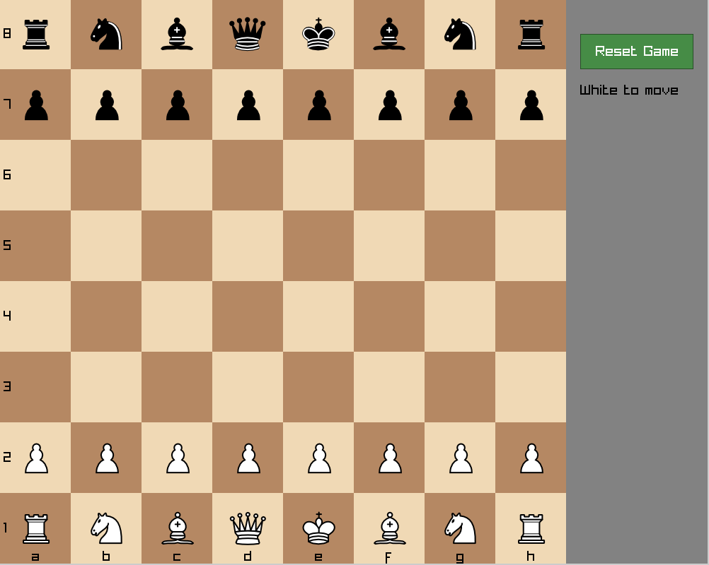

# Chess GUI

A fully functional chess game written in C with a GUI built using raylib.



## Features

- Complete chess rules implementation
- 10x12 mailbox board representation
- Legal move validation for all pieces
- Castling (kingside and queenside)
- En passant captures
- Pawn promotion (auto-promotes to queen)
- Check, checkmate, and stalemate detection
- FEN string parsing for custom positions
- Clean GUI with piece highlighting

## Dependencies

- [raylib](https://www.raylib.com/) - Graphics library
- GCC compiler
- Linux (X11)

### Installing raylib on Ubuntu/Debian

```bash
sudo apt install libraylib-dev
```

Or build from source:

```bash
git clone https://github.com/raysan5/raylib.git
cd raylib/src
make PLATFORM=PLATFORM_DESKTOP
sudo make install
```

## Building

```bash
make
```

## Running

```bash
# Start a new game
./chess

# Load a position from FEN string
./chess --fen "rnbqkbnr/pppppppp/8/8/4P3/8/PPPP1PPP/RNBQKBNR b KQkq e3 0 1"

# Run tests
./chess --test

# Show help
./chess --help
```

## How to Play

1. Click on a piece to select it
2. Click on a destination square to move
3. Invalid moves are rejected automatically
4. Use the "Reset Game" button to start over

## Project Structure

```
.
├── main.c          # Entry point, CLI argument parsing
├── board.c/.h      # Board representation and FEN parsing
├── move.c/.h       # Move validation and execution
├── gui.c/.h        # Raylib GUI implementation
├── test.c/.h       # Test suite
├── assets/         # Piece images (wp.png, bn.png, etc.)
└── Makefile
```

## Board Representation

Uses a 10x12 mailbox array where:
- Squares 21-28 = rank 8 (black's back rank)
- Squares 91-98 = rank 1 (white's back rank)
- Files 1-8 within each rank
- Padding allows simple off-board detection

## License

MIT